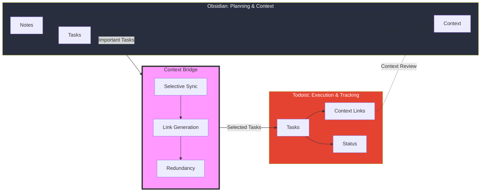
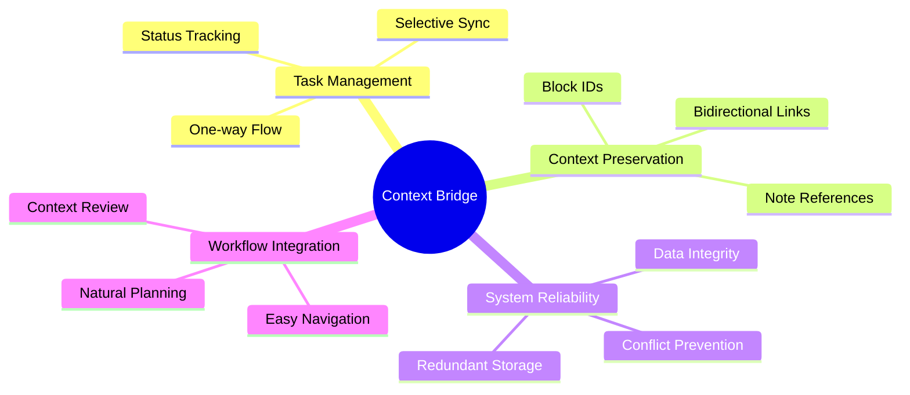

# Obsidian Todoist Context Bridge

A powerful Obsidian plugin that bridges your note-taking and task management workflows by maintaining strong contextual connections between Obsidian and Todoist. Unlike traditional sync plugins, Todoist Context Bridge helps you highlight important tasks while preserving their rich context, ensuring you never lose sight of the bigger picture.

## How It Works



## Key Features Explained



## Why Choose This Plugin?

In the landscape of Todoist integration plugins, Todoist Context Bridge stands out by solving a unique challenge: maintaining the crucial connection between tasks and their context.

### Comparison with Other Plugins

| Feature | Todoist Context Bridge | Traditional Sync Plugins | Other Todoist Plugins |
|---------|----------------------|-------------------------|---------------------|
| Task Sync | One-way, intentional | Often bidirectional | Varies |
| Context Preservation | ✓ Strong links to notes | ✗ Limited or none | ✗ Usually none |
| Task Selection | Selective, focused | Usually all tasks | Varies |
| System Reliability | Redundant storage | Single system | Single system |
| Completion Workflow | Context-aware | Task-only focus | Task-only focus |

### Key Differentiators

1. **Context-First Approach**
   - Maintains rich links between tasks and notes
   - Encourages revisiting context before completion
   - Preserves the full story behind each task

2. **Intentional Task Highlighting**
   - Selectively promote important tasks to Todoist
   - Keep task management focused and relevant
   - Prevent task overload in Todoist

3. **Robust System Design**
   - Redundant task storage for reliability
   - One-way sync prevents conflicts
   - Clear separation of concerns

4. **Thoughtful Workflow Integration**
   - Natural flow between planning and execution
   - Easy context navigation when needed
   - Structured task completion process

## The Story Behind This Plugin

This plugin emerged from a specific need: highlighting and tracking important tasks while maintaining their rich context. As an Obsidian user who relies on Todoist for task management, I found that not every task in my notes needed to be in Todoist - only the significant ones that required focused attention and tracking.

### The Problem

While Obsidian excels at capturing tasks within their full context (in notes, projects, or thinking processes), these tasks can get lost among countless other notes and ideas. Todoist, on the other hand, excels at highlighting and tracking important tasks, but lacks the rich context in which these tasks were created.

### The Solution

This plugin bridges this gap by:

1. Allowing you to selectively sync important tasks to Todoist
2. Maintaining strong links back to the original Obsidian context
3. Creating a reliable redundancy system - tasks exist both in your notes and your task manager
4. Keeping your task management system focused on what truly matters

This approach means:

- Your notes remain your primary source of truth
- Important tasks get the spotlight they deserve in Todoist
- You always have access to the full context when needed
- Your task management system stays clean and focused

## Design Philosophy

The design of Todoist Context Bridge is built around three core principles:

1. **Context is King**
   - Tasks don't exist in isolation - they emerge from thoughts, plans, and projects
   - Original note context is crucial for effective task completion
   - Strong bidirectional links ensure context is always accessible
   - Reviewing context before completion leads to better outcomes

2. **Intentional Task Management**
   - Not every task needs to be in Todoist
   - Important tasks deserve special attention
   - Selective syncing keeps your task manager focused
   - Clear separation between planning and execution

3. **System Reliability**
   - Redundant storage provides safety and accessibility
   - One-way sync prevents conflicts and corruption
   - Clear workflows reduce confusion
   - Strong links maintain system integrity

This approach encourages a natural workflow where:

- Obsidian serves as your thinking and planning environment
- Todoist highlights your important actionable items
- Context bridges ensure you never lose sight of the bigger picture
- Each tool is used for its strengths

## Key Features

### One-Way Synchronization

- **Intentional Design**: Tasks flow from Obsidian to Todoist only
- **Data Integrity**: Prevents sync conflicts and data corruption
- **Clear Workflow**: Use Obsidian for planning, Todoist for execution
- **Note Context**: Tasks remain connected to their source notes

### Smart Duplicate Detection

- **Intelligent Checking**: Verifies both content and links
- **Multiple Verification Methods**:
  - Checks existing Todoist links in notes
  - Searches task descriptions in Todoist
  - Verifies block IDs and Advanced URIs
- **Configurable Behavior**: 
  - Option to allow intentional duplicates
  - Special handling for completed tasks

### Task Management

- **Status-Aware Sync**: Only syncs open tasks by default
- **Project Integration**: Sync tasks to any Todoist project, with Inbox as default
- **Error Prevention**: Comprehensive validation before sync
- **User-Friendly Messages**: Clear feedback for all operations

### Advanced Linking

- **Automatic Link Generation**: Creates Todoist task links as sub-items
- **Deep Linking**: Uses Advanced URI for precise note references
- **Block-Level Precision**: Adds unique block IDs for exact task location
- **Link Persistence**: Maintains connections even if notes are moved
- **Custom ID Management**: Configurable note and block ID formats

## What Makes This Plugin Different?

Unlike other Todoist integration plugins, Todoist Context Bridge:

1. **Focuses on One-Way Sync**: 
   - Deliberately designed for Obsidian → Todoist workflow
   - Prevents sync conflicts and maintains data integrity
   - Perfect for using Obsidian as your note-taking and task creation hub
2. **Preserves Context**:
   - Creates deep links back to your Obsidian notes
   - Maintains block-level references for precise task location
   - Integrates with Advanced URI for reliable note linking
3. **Keeps It Simple**:
   - No complex configuration required
   - Minimal interface with maximum functionality
   - Fast and lightweight operation

## Installation

1. Open Obsidian Settings
2. Navigate to Community Plugins and disable Safe Mode
3. Click Browse and search for "Todoist Context Bridge"
4. Install the plugin and enable it

### Requirements

- Obsidian v0.15.0 or higher
- [Advanced URI](https://obsidian.md/plugins?id=obsidian-advanced-uri) plugin
- Todoist account and API token

## Setup

1. Get your Todoist API token:
   - Log in to Todoist
   - Go to Settings → Integrations → Developer
   - Copy your API token

2. Configure the plugin:
   - Open Obsidian Settings → Todoist Context Bridge
   - Paste your Todoist API token
   - Select your default project (optional)
   - Adjust other settings as needed

## Usage

### Basic Task Syncing

1. Create a task in Obsidian:
   ```markdown
   - [ ] Review meeting notes
   ```
2. Place your cursor on the task line
3. Use either:
   - Command palette: "Sync selected task to Todoist"
   - Hotkey: (customizable in Settings → Hotkeys)
4. The task will be synced, and a link will be added:
   ```markdown
   - [ ] Review meeting notes
       - 🔗 [View in Todoist](https://todoist.com/app/task/12345678)
   ```

### Advanced Features

#### Project Selection

- Set a default project in settings
- Tasks sync to Inbox if no project is specified

#### Duplicate Handling

- Enable/disable duplicate task creation
- Configure handling of completed tasks
- Smart detection of existing tasks

#### ID Management

- Customize note ID field in frontmatter
- Configure block ID format
- Maintains reliable links between platforms

## Tips and Best Practices

1. **Task Organization**:
   - Keep tasks in relevant note contexts
   - Use clear, actionable task descriptions
   - Consider project structure in both platforms
2. **Efficient Workflow**:
   - Set up keyboard shortcuts for quick syncing
   - Use default projects for common task types
   - Review and clean up completed tasks regularly
3. **Link Management**:
   - Keep generated links for reference
   - Use block IDs for precise navigation
   - Maintain consistent note organization

## Troubleshooting

### Common Issues

1. **Task Not Syncing**
   - Check API token validity
   - Ensure cursor is on a task line
   - Verify Advanced URI plugin is installed
2. **Link Not Working**
   - Check if note has moved
   - Verify vault name is correct
   - Ensure Advanced URI plugin is enabled
3. **Duplicate Tasks**
   - Check duplicate task settings
   - Review existing task links
   - Verify task completion status

## Development Journey

The development of this plugin has been guided by real-world usage and user feedback:

1. **Initial Concept**
   - Started with the need to highlight important tasks from notes
   - Focused on maintaining the connection between tasks and their context
   - Aimed for a clean, focused task management system
2. **Key Design Decisions**
   - Chose one-way sync to maintain note integrity
   - Implemented selective task syncing for better focus
   - Added robust linking for easy context access
   - Created redundancy through dual task storage
3. **User-Driven Improvements**
   - Enhanced project selection for better task organization
   - Added configurable duplicate handling
   - Improved error messages and validation
   - Implemented status-aware syncing

### Future Vision

While maintaining its core focus on simplicity and reliability, the plugin will continue to evolve:

1. **Planned Enhancements**
   - More flexible task selection options
   - Enhanced metadata preservation
   - Additional project management features
   - Improved error reporting and recovery
2. **Core Principles**
   - Keep the focus on important tasks
   - Maintain strong context links
   - Preserve note integrity
   - Ensure system reliability

## Support and Contribution

- [GitHub Issues](https://github.com/wenlzhang/obsidian-simple-todoist-sync/issues) for bug reports and feature requests
- [GitHub Discussions](https://github.com/wenlzhang/obsidian-simple-todoist-sync/discussions) for questions and ideas
- Pull requests are welcome!

## Support Me

<a href='https://ko-fi.com/C0C66C1TB' target='_blank'></a>
