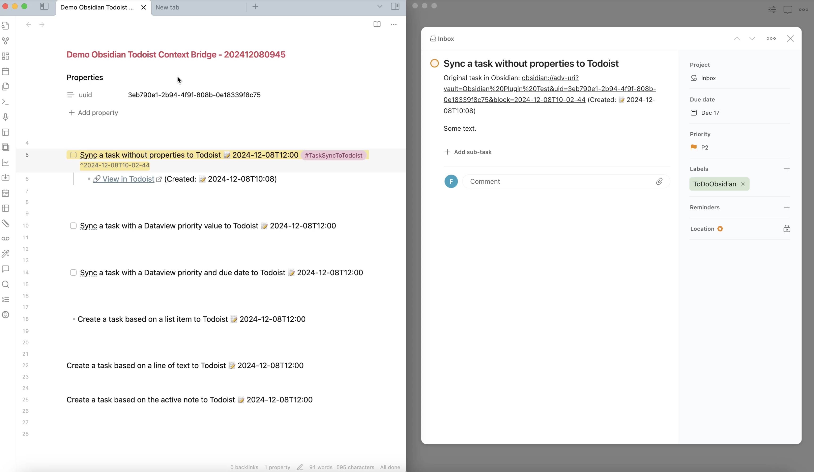
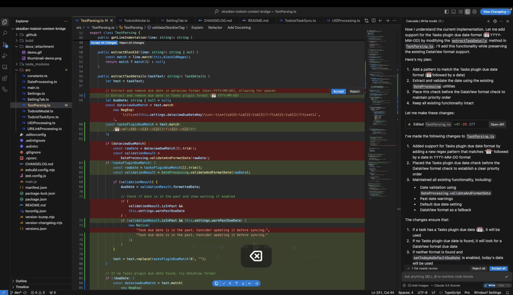

# Todoist Context Bridge

 

A powerful [Obsidian](https://obsidian.md/) plugin that bridges your Obsidian notes with Todoist tasks while preserving rich context, helping you highlight important tasks and maintain seamless workflows between the two platforms. Seamlessly integrate with [Dataview](https://github.com/blacksmithgu/obsidian-dataview) and [Tasks](https://github.com/obsidian-tasks-group/obsidian-tasks) plugins.

## What Makes This Plugin Different

Unlike traditional Todoist sync plugins that try to sync everything, Context Bridge helps you:

- 🔌 **Integrate** with [Dataview](https://ptkm.net/obsidian-todoist-context-bridge-dataview-integration) and [Tasks](https://ptkm.net/obsidian-todoist-context-bridge-tasks-integration) plugins
- ✨ **Highlight** important tasks selectively in Todoist
- 🔄 **Sync** tasks bidirectionally between Obsidian and Todoist
- ⏱️ **Maintain** temporal context
- 🎯 **Focus** on what truly matters
- 📝 **Support** various content formats (lists, tasks, callouts, quotes)

## Videos and Articles

### Videos

### Articles

To learn more about PTKM and how to use this plugin, check out the following articles:

- [The Importance of Context in Task and Knowledge Management: Leveraging the Obsidian Todoist Context Bridge Plugin - PTKM](https://ptkm.net/blog-context-importance-todoist-context-bridge)
- [Bridging Tasks and Knowledge in Obsidian: Introducing the Todoist Context Bridge Plugin - PTKM](https://ptkm.net/blog-introducing-todoist-context-bridge)

## Why You Need Todoist Context Bridge

[Todoist Context Bridge](https://ptkm.net/obsidian-todoist-context-bridge) was crafted with five [PTKM Core Principles](https://ptkm.net/ptkm-core-principles) that shape its functionality:

- **Task-Centered Workflow**: Prioritizing efficient task management and natural workflow integration
- **Context Preservation**: Ensuring no valuable information is lost in the task management process
- **Linking Everything**: Bridging the gap between Obsidian and Todoist
- **Focus on Priority**: Helping users concentrate on what truly matters
- **Reliable Redundancy**: Maintaining data integrity through smart synchronization

**Todoist Context Bridge** was born from a real-world challenge: the need to effectively highlight and track important tasks while preserving their complete context. As both an Obsidian enthusiast and Todoist power user, I discovered that while not every note-taking task warranted a place in my task manager, the crucial ones deserved focused attention and reliable tracking.

### The Challenge

Modern knowledge workers face a common dilemma: Obsidian excels at capturing tasks with rich context - embedding them within notes, projects, and thought processes. However, these important tasks can easily become buried in an ocean of notes and ideas. Todoist shines at task tracking and highlighting, but traditionally lacks the deep context that birthed these tasks.

### The Bridge

**Todoist Context Bridge** elegantly solves this challenge through four key mechanisms:

1. **Selective Sync**: Thoughtfully choose which tasks deserve promotion to your Todoist workflow
2. **Contextual Links**: Maintain robust bidirectional connections to your original Obsidian notes
3. **Reliable Redundancy**: Ensure task security through strategic presence in both systems
4. **Focused Management**: Keep your task system lean and relevant by promoting only what matters

## Bidirectional Task Completion Sync

This plugin supports automatic bidirectional synchronization of task completion status between Obsidian and Todoist. When enabled, the plugin will:

### Sync behavior

**Todoist → Obsidian:**
- When you mark a task as completed in Todoist, it will be automatically marked as completed in Obsidian
- A completion timestamp will be appended to the task line (if enabled)
- The timestamp can use either the actual Todoist completion time or the sync time

**Obsidian → Todoist:**
- When you mark a task as completed in Obsidian, it will be automatically marked as completed in Todoist
- No timestamp is added to the Obsidian task (to avoid conflicts with other plugins)
- We recommend using the [Task Marker](https://github.com/wenlzhang/obsidian-task-marker) plugin for Obsidian-side timestamping

### Configuration

1. **Enable bidirectional sync**: Toggle the "Enable bidirectional sync" setting
2. **Set sync interval**: Choose how often to check for changes (1-60 minutes)
3. **Choose sync scope**: Sync tasks in current file only or all files
4. **Enable completion timestamps**: Toggle timestamp appending when syncing from Todoist
5. **Choose timestamp source**: Use Todoist's actual completion time or the sync time
6. **Customize timestamp format**: Configure the timestamp format using moment.js syntax

### Performance optimization

The plugin offers two performance optimization approaches:

#### Time Window Filtering
Optimizes sync performance for users with many historical tasks:

- **Time window filtering**: Only sync tasks modified/completed within a specified time window (default: 7 days)
- **Smart filtering logic**: 
  - Files with linked tasks are always processed regardless of age
  - Tasks with future due dates are always included regardless of task age
  - Old files without linked tasks are skipped for performance
  - Completed tasks without due dates are filtered by the time window
- **Configurable window**: Set between 0-90 days (0 = sync all tasks, disables filtering)
- **Performance impact**: With a 7-day window, users typically see ~28x faster sync performance

#### Enhanced Log-Based Sync System
For maximum performance and reliability, enable the enhanced sync system:

- **Intelligent state tracking**: Uses persistent journal instead of full vault scanning
- **Incremental sync**: Only processes new and changed tasks (O(changed tasks) vs O(total tasks))
- **Change detection**: Uses content hashing and timestamps to detect modifications
- **Persistent journal**: Stores sync state in `.obsidian/plugins/todoist-context-bridge/sync-journal.json`
- **Error recovery**: Built-in retry mechanisms and journal corruption handling
- **Progress tracking**: Optional sync progress notifications
- **Scalability**: Performance doesn't degrade with vault size or historical data

**Performance Comparison**:
- Traditional scanning: Processes all tasks every sync cycle
- Enhanced sync: Processes only changed tasks since last sync
- Expected improvement: 10-100x faster for large vaults with minimal changes

**When to use enhanced sync**:
- Large vaults (1000+ tasks)
- Frequent sync intervals
- Performance-critical workflows
- Users who want maximum reliability

Both optimizations can be used together for optimal performance.

#### Note ID-Based File Tracking
The enhanced sync system uses robust file tracking to handle file moves gracefully:

- **Primary identifier**: Uses note ID from frontmatter (configured via `uidField` setting)
- **Secondary fallback**: File path serves as backup identifier
- **Automatic migration**: Existing sync data is automatically upgraded to use note IDs
- **Path correction**: When files are moved, paths are automatically updated in the sync journal
- **Orphan cleanup**: Tasks for deleted files are automatically removed from the journal
- **Seamless operation**: File moves and renames don't break task synchronization

#### Notification Preferences
Customize notification behavior to reduce distraction:

- **Desktop preferences**: Choose "All notifications", "Errors only", or "No notifications"
- **Mobile preferences**: Set separate preferences for mobile devices or use same as desktop
- **Default setting**: "Errors only" to minimize notification noise while keeping important alerts
- **Smart filtering**: Success notifications can be suppressed while keeping error notifications

### Requirements

- Tasks must be linked between Obsidian and Todoist using the existing sync functionality
- Both platforms must have the same task content for reliable matching
- The plugin will only sync completion status for tasks that exist in both platforms

### Recommended Setup

For comprehensive timestamp tracking in Obsidian, we recommend using the **[Task Marker](https://github.com/wenlzhang/obsidian-task-marker)** plugin alongside Todoist Context Bridge. Task Marker will automatically timestamp all task status changes in Obsidian, including completions, providing you with complete temporal tracking.

To enable bidirectional sync:
1. Go to plugin settings
2. Enable "Bidirectional task completion sync"
3. Optionally enable "Completion timestamp" for Todoist→Obsidian sync
4. Configure your preferred timestamp format using moment.js format strings

## Documentation

📚 **[View Full Documentation](https://ptkm.net/obsidian-todoist-context-bridge)**

Visit the documentation site to learn how to make the most of Todoist Context Bridge in your Obsidian workflow.

## Support & Community

This plugin is a labor of love, developed and maintained during my free time after work and on weekends. A lot of thought, energy, and care goes into making it reliable, user-friendly, and aligned with PTKM principles.

If you find this plugin valuable in your daily workflow:

- If it helps you manage tasks more effectively
- If it saves you time and mental energy
- If it makes your work between Obsidian and Todoist smoother

Please consider supporting my work. Your support would mean the world to me and would help me dedicate more time and energy to:

- Developing new features
- Maintaining code quality
- Providing support and documentation
- Making the plugin even better for everyone

### Ways to Support

You can support this project in several ways:

- ⭐ Star the project on GitHub
- 💝 
- [Sponsor](https://github.com/sponsors/wenlzhang) my work on GitHub
- 💌 Share your success stories and feedback
- 📢 Spread the word about the plugin
- 🐛 [Report issues](https://github.com/wenlzhang/obsidian-todoist-context-bridge/issues) to help improve the plugin

Thank you for being part of this journey! 🙏
