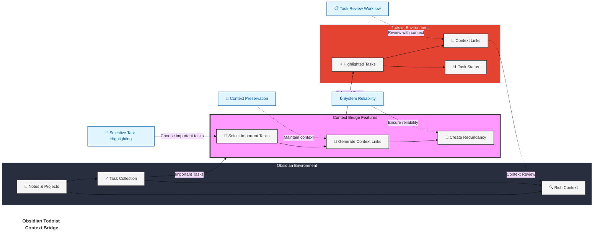
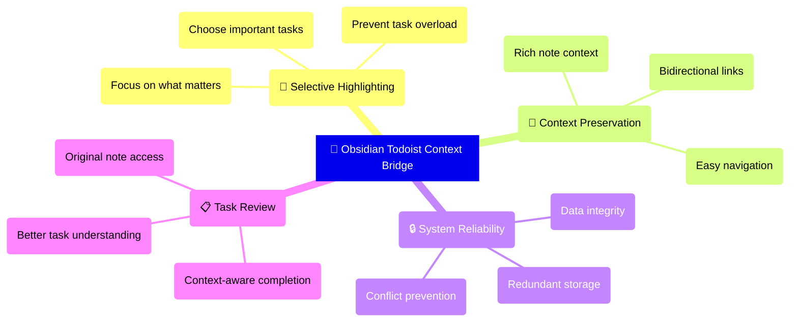

# Todoist Context Bridge

 

A powerful [Obsidian](https://obsidian.md/) plugin that bridges your Obsidian notes with Todoist tasks while preserving rich context, helping you highlight important tasks and maintain seamless workflows between the two platforms.

## What Makes This Plugin Different?

Unlike traditional Todoist sync plugins that try to sync everything, Context Bridge helps you:

- ✨ **Highlight** important tasks selectively in Todoist
- 🔄 **Preserve** rich context with bidirectional links
- 🎯 **Focus** on what truly matters
- 🔒 **Maintain** system reliability through one-way sync

## The Story Behind This Plugin

[Obsidian Todoist Context Bridge](https://exp.ptkm.net/obsidian-todoist-context-bridge) was crafted with five [PTKM Core Principles](https://exp.ptkm.net/ptkm-core-principles) that shape its functionality:

- **Task-Centered Workflow**: Prioritizing efficient task management and natural workflow integration
- **Context Preservation**: Ensuring no valuable information is lost in the task management process
- **Linking Everything**: Bridging the gap between Obsidian and Todoist
- **Focus on Priority**: Helping users concentrate on what truly matters
- **Reliable Redundancy**: Maintaining data integrity through smart synchronization

This plugin was born from a real-world challenge: the need to effectively highlight and track important tasks while preserving their complete context. As both an Obsidian enthusiast and Todoist power user, I discovered that while not every note-taking task warranted a place in my task manager, the crucial ones deserved focused attention and reliable tracking.

### The Challenge

Modern knowledge workers face a common dilemma: Obsidian excels at capturing tasks with rich context - embedding them within notes, projects, and thought processes. However, these important tasks can easily become buried in an ocean of notes and ideas. Todoist shines at task tracking and highlighting, but traditionally lacks the deep context that birthed these tasks.

### The Bridge

This plugin elegantly solves this challenge through four key mechanisms:

1. **Selective Sync**: Thoughtfully choose which tasks deserve promotion to your Todoist workflow
2. **Contextual Links**: Maintain robust bidirectional connections to your original Obsidian notes
3. **Reliable Redundancy**: Ensure task security through strategic presence in both systems
4. **Focused Management**: Keep your task system lean and relevant by promoting only what matters

## Key Features

### Task Management and Context

- **Selective Task Highlighting**
    - Choose which tasks deserve attention in Todoist
    - Keep your task manager focused and relevant
    - Prevent task overload and maintain clarity
- **Rich Context Preservation**
    - Maintain strong links between tasks and their source notes
    - Access original context directly from Todoist tasks
    - Review full context before completing tasks
    - Navigate seamlessly between platforms
- **Flexible Priority Mapping**
    - Customize Dataview key for priority (e.g., `p` and `priority`)
    - Define multiple values for each priority level
    - Map various notations to Todoist priorities:
        - Numeric values (e.g., `[p::1]`, `[priority::2]`)
        - Text values (e.g., `[p::high]`, `[p::p1]`)
    - Default priority for tasks without explicit priority
    - Priority values shown in task creation modal
- **Smart Duplicate Detection**
    - Intelligent checking of content and links
    - Multiple verification methods:
        - Existing Todoist links in notes
        - Task descriptions in Todoist
        - Block IDs and Advanced URIs
    - Configurable duplicate handling
    - Special handling for completed tasks
- **Block-Level Precision**
    - Exact task location tracking
    - Customizable block IDs
    - Reliable note navigation
- **Smart Text Cleanup**
    - Built-in patterns for common Markdown elements
    - Customizable regex patterns for text cleaning
    - Remove timestamps, emojis, tags, and more
    - Keep task names clean and focused in Todoist
- **Flexible Due Dates**
    - Customizable dataview key for due dates
    - Standard format: `[due::YYYY-MM-DD]` or `[due::YYYY-MM-DDTHH:mm]`
    - Use any English key (e.g., `[deadline::2024-01-01]`)
    - Compatible with Dataview plugin format

### Due Date Format

The plugin supports due dates in Dataview format. By default, it uses the `due` key (e.g., `[due::2024-01-01]`), but you can customize this in settings:

1. **Format Options**
   - Date only: `[due::YYYY-MM-DD]`
   - Date and time: `[due::YYYY-MM-DDTHH:mm]`
2. **Customization**
   - Change the key in settings (e.g., "deadline", "duedate")
   - Use only English characters and symbols supported by Dataview
   - Examples: `[deadline::2024-01-01]`, `[duedate::2024-01-01T09:00]`
3. **Requirements**
   - Keys must be valid Dataview inline field names
   - Date format must follow the YYYY-MM-DD pattern
   - Time format (optional) must follow THH:mm pattern

### Flexible Date Handling

#### Due Date Formats
- **Standard Formats**
    - Date only: `[due::YYYY-MM-DD]`
    - Date and time: `[due::YYYY-MM-DDTHH:mm]`
    - Customizable key (e.g., `deadline`, `duedate`)
- **Relative Dates**
    - Simple format: `1d` (tomorrow), `0d` (today)
    - Optional plus sign: `+1d` (tomorrow)
    - Supports any number of days: `20d`, `30d`, etc.
- **Weekend Handling**
    - Context-aware weekend skipping
    - Optional per-task weekend skipping
    - Ideal for work vs personal tasks
    - Example: `5d` with weekend skipping will skip Saturday and Sunday
- **Moment.js Format Support**
    - Custom date formats using Moment.js patterns
    - Configurable through settings
    - Example: `[📅 ]YYYY-MM-DD` matches `📅 2024-01-01`

#### Date Processing Features
- **Smart Date Validation**
    - Validates all date formats before processing
    - Clear error messages for invalid dates
    - Past date warnings (configurable)
- **Contextual Weekend Skipping**
    - Choose to skip weekends per task
    - Visible only for relative dates
    - Recommended for work-related tasks
    - Maintains work-life balance
- **Flexible Processing**
    - Multiple date format support
    - Graceful fallback between formats
    - Preserves time information when provided
- **User Experience**
    - Clear date format hints in task modal
    - Intuitive weekend skip toggle
    - Past date confirmation dialog
    - Date validation feedback

### Priority Format and Mapping

The plugin offers flexible priority mapping through Dataview format. You can customize both the priority key and the values that map to each priority level:

1. **Priority Key Customization**
   - Default key is `p` (e.g., `[p::1]`)
   - Customize in settings (e.g., `priority`, `pr`)
   - Must be a valid Dataview inline field name
   - Examples: `[p::high]`, `[priority::p1]`
2. **Value Mapping**
   - Map multiple values to each Todoist priority level
   - Supports both numeric and text values
   - Examples for Priority 1 (Highest):
     - Numeric: `[p::1]`
     - Text: `[p::high]`, `[priority::p1]`
   - Same value can't map to different priorities
3. **Default Priority**
   - Set default priority for tasks without explicit priority
   - Applied when no priority field is found
   - Configurable in settings (Priority 1-4)
4. **Priority Display**
   - Priority options shown in task creation modal
   - Displays both priority level and mapped values
   - Example: "Priority 1 (Highest) [1, high, p1]"
   - Makes it easy to see available priority options
5. **Usage Tips**
   - Use consistent notation within notes
   - Consider your existing workflow when choosing key
   - Map values that match your natural language
   - Example mappings:
     - Priority 1: `1, high, p1`
     - Priority 2: `2, medium, p2`
     - Priority 3: `3, low, p3`
     - Priority 4: `4, none, p4`

### Text Cleanup Patterns

The plugin provides powerful text cleanup capabilities to ensure your Todoist tasks remain clean and focused. These patterns are applied when syncing tasks from Obsidian to Todoist.

#### Default Cleanup Patterns

When enabled, the following patterns are automatically removed:

| Pattern Type | Example | Regex Pattern |
|-------------|---------|---------------|
| Checkboxes | `- [ ] Task` | `^[\s-]*\[[ x?/-]\]` |
| Timestamps | `📝 2024-11-23T22:09` | `📝\s*\d{4}-\d{2}-\d{2}(?:T\d{2}:\d{2})?` |
| Block IDs | `^abc123` | `\^[a-zA-Z0-9-]+$` |
| Tags | `#project` | `#[^\s]+` |
| Emojis | `📅 ✅` | Unicode emoji ranges |

#### Dataview Cleanup

Remove Dataview metadata fields from your tasks:

1. **Built-in Handling**:
   - Due date fields (e.g., `[due::2024-01-01]`)
   - Priority fields (e.g., `[p::1]`)
2. **Custom Fields**:
   - Add your own Dataview keys to remove
   - Example: If you use `[category::work]`, `[created::2024-01-01]` and `[c::#tag]`, add `category, created, c` to remove it
   - Multiple keys supported (comma-separated)

#### Moment.js Format Cleanup

Remove timestamps with optional prefixes using Moment.js format:

1. **Pattern Format**:
   - Uses Moment.js date format tokens
   - Optional text in square brackets
   - Multiple patterns supported (comma-separated)
2. **Common Examples**:
   - Basic timestamp: `YYYY-MM-DD` (matches `2024-01-01`)
   - With time: `YYYY-MM-DDTHH:mm` (matches `2024-01-01T10:30`)
   - With prefix: `[📝 ]YYYY-MM-DD` (matches `📝 2024-01-01`)
   - Multiple prefixes: `[📝 ]YYYY-MM-DDTHH:mm, [❎ ]YYYY-MM-DDTHH:mm`
3. **Tips**:
   - Square brackets `[]` match literal text
   - Use `T` as literal time separator
   - Common tokens: `YYYY` (year), `MM` (month), `DD` (day), `HH` (24h), `mm` (minutes)
   - See [Moment.js docs](https://momentjs.com/docs/#/displaying/format/) for more tokens

#### Custom Cleanup Patterns

Add your own regex patterns to handle specific cleanup needs:

1. **Pattern Format**:
   - One pattern per line
   - Uses JavaScript regex syntax
   - Applied with global and unicode flags
2. **Common Examples**:
   - Remove date stamps: `\[\d{4}-\d{2}-\d{2}\]` (matches `[2024-01-01]`)
   - Remove list markers: `^- ` (matches leading hyphens)
   - Remove parentheses: `\([^)]*\)` (matches `(any text)`)
3. **Tips**:
   - Test patterns on [regex101.com](https://regex101.com/) with JavaScript flavor
   - Patterns are cumulative with default patterns when enabled
   - Use `^` for start of line, `$` for end of line

## Design Philosophy

Context Bridge is built on three core principles:

1. **Context is King**
    - Tasks don't exist in isolation - they emerge from thoughts, plans, and projects
    - Original note context is crucial for effective task completion
    - Strong bidirectional links ensure context is always accessible
    - Reviewing context before completion leads to better outcomes
2. **Intentional Task Management**
    - Not every task needs to be in Todoist
    - Important tasks deserve special attention
    - Selective syncing keeps your task manager focused
    - Clear separation between planning and execution
3. **System Reliability**
    - Redundant storage provides safety and accessibility
    - One-way sync prevents conflicts and corruption
    - Clear workflows reduce confusion
    - Strong links maintain system integrity

## How It Works

### Core Features Explained

## Quick Start

1. Install the plugin from Obsidian Community Plugins
2. Add your Todoist API token in settings
3. Start highlighting tasks with the command palette or context menu

[Detailed Setup Guide](#setup-guide) | [Usage Examples](#usage-examples)

## Setup Guide

1. Get your Todoist API token:
    - Log in to Todoist → Settings → Integrations → API token
    - Copy your token
2. Configure the plugin:
    - Open Obsidian Settings → Todoist Context Bridge
    - Paste your API token
    - Verify token
    - Select default project

## Usage Examples

- Sync an existing task from Obsidian to Todoist
    - Task properties such as due date are preserved
    - Optionally, one can add text in the description
- Create a task from selected text
    - Optionally, one can add text in the description
- Create a task linked to the current file
    - Optionally, one can add text in the description

## Support

- [Report Issues](https://github.com/wenlzhang/obsidian-todoist-context-bridge/issues)
- [Ask Questions](https://github.com/wenlzhang/obsidian-todoist-context-bridge/discussions)

If you find this plugin helpful, consider [sponsoring my work](https://github.com/sponsors/wenlzhang) or

