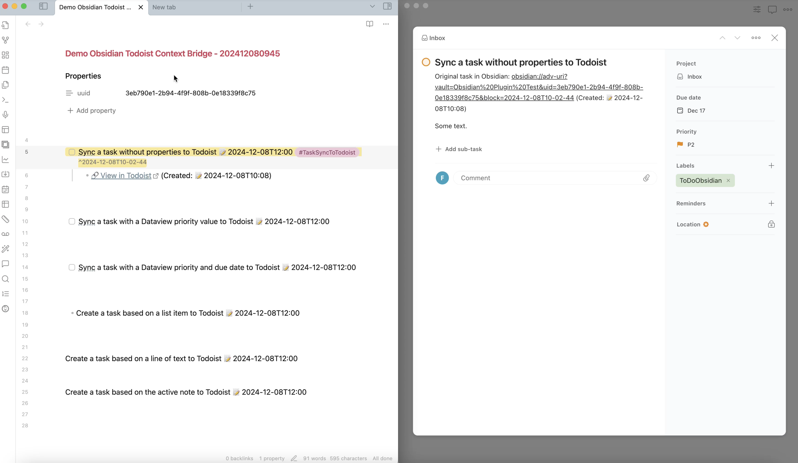
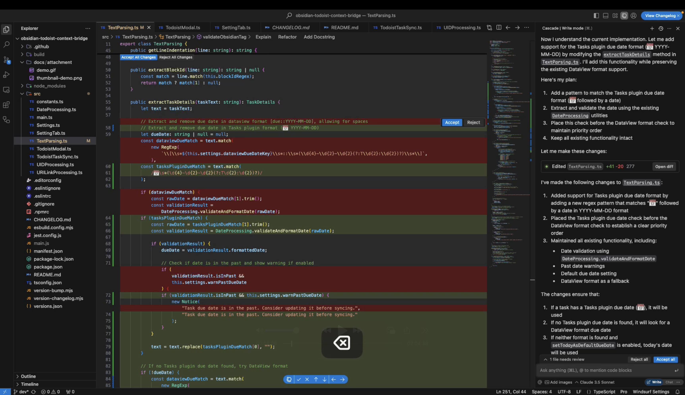

# Todoist Context Bridge

 

A powerful [Obsidian](https://obsidian.md/) plugin that bridges your Obsidian notes with Todoist tasks while preserving rich context, helping you highlight important tasks and maintain seamless workflows between the two platforms. Seamlessly integrate with [Dataview](https://github.com/blacksmithgu/obsidian-dataview) and [Tasks](https://github.com/obsidian-tasks-group/obsidian-tasks) plugins.

## What Makes This Plugin Different

Unlike traditional Todoist sync plugins that try to sync everything, Context Bridge helps you:

- 🔌 **Integrate** with [Dataview](https://ptkm.net/obsidian-todoist-context-bridge-dataview-integration) and [Tasks](https://ptkm.net/obsidian-todoist-context-bridge-tasks-integration) plugins
- ✨ **Highlight** important tasks selectively in Todoist
- 🔄 **Sync** tasks bidirectionally between Obsidian and Todoist
- ⏱️ **Maintain** temporal context
- 🎯 **Focus** on what truly matters
- 📝 **Support** various content formats (lists, tasks, callouts, quotes)

## 🌐 Chat With Your Todoist Tasks

Chat with your Todoist tasks directly in your browser at **[task-chat-web.vercel.app](https://task-chat-web.vercel.app/)**. Configure your Todoist API token and AI provider keys to get started. All data is stored locally in your browser for privacy.

## Videos and Articles

### Videos

### Articles

To learn more about PTKM and how to use this plugin, check out the following articles:

- [The Importance of Context in Task and Knowledge Management: Leveraging the Obsidian Todoist Context Bridge Plugin - PTKM](https://ptkm.net/blog-context-importance-todoist-context-bridge)
- [Bridging Tasks and Knowledge in Obsidian: Introducing the Todoist Context Bridge Plugin - PTKM](https://ptkm.net/blog-introducing-todoist-context-bridge)

## Why You Need Todoist Context Bridge

[Todoist Context Bridge](https://ptkm.net/obsidian-todoist-context-bridge) was crafted with five [PTKM Core Principles](https://ptkm.net/ptkm-core-principles) that shape its functionality:

- **Task-Centered Workflow**: Prioritizing efficient task management and natural workflow integration
- **Context Preservation**: Ensuring no valuable information is lost in the task management process
- **Linking Everything**: Bridging the gap between Obsidian and Todoist
- **Focus on Priority**: Helping users concentrate on what truly matters
- **Reliable Redundancy**: Maintaining data integrity through smart synchronization

**Todoist Context Bridge** was born from a real-world challenge: the need to effectively highlight and track important tasks while preserving their complete context. As both an Obsidian enthusiast and Todoist power user, I discovered that while not every note-taking task warranted a place in my task manager, the crucial ones deserved focused attention and reliable tracking.

### The Challenge

Modern knowledge workers face a common dilemma: Obsidian excels at capturing tasks with rich context - embedding them within notes, projects, and thought processes. However, these important tasks can easily become buried in an ocean of notes and ideas. Todoist shines at task tracking and highlighting, but traditionally lacks the deep context that birthed these tasks.

### The Bridge

**Todoist Context Bridge** elegantly solves this challenge through four key mechanisms:

1. **Selective Sync**: Thoughtfully choose which tasks deserve promotion to your Todoist workflow
2. **Contextual Links**: Maintain robust bidirectional connections to your original Obsidian notes
3. **Reliable Redundancy**: Ensure task security through strategic presence in both systems
4. **Focused Management**: Keep your task system lean and relevant by promoting only what matters

## Documentation

📚 **[View Full Documentation](https://ptkm.net/obsidian-todoist-context-bridge)**

Visit the documentation site to learn how to make the most of Todoist Context Bridge in your Obsidian workflow.

## Support & Community

This plugin is a labor of love, developed and maintained during my free time after work and on weekends. A lot of thought, energy, and care goes into making it reliable, user-friendly, and aligned with PTKM principles.

If you find this plugin valuable in your daily workflow:

- If it helps you manage tasks more effectively
- If it saves you time and mental energy
- If it makes your work between Obsidian and Todoist smoother

Please consider supporting my work. Your support would mean the world to me and would help me dedicate more time and energy to:

- Developing new features
- Maintaining code quality
- Providing support and documentation
- Making the plugin even better for everyone

### Ways to Support

You can support this project in several ways:

- ⭐ Star the project on GitHub
- 💝 
- [Sponsor](https://github.com/sponsors/wenlzhang) my work on GitHub
- 💌 Share your success stories and feedback
- 📢 Spread the word about the plugin
- 🐛 [Report issues](https://github.com/wenlzhang/obsidian-todoist-context-bridge/issues) to help improve the plugin

Thank you for being part of this journey! 🙏
