# Todoist Context Bridge

[](https://github.com/wenlzhang/obsidian-todoist-context-bridge/releases) 

A powerful [Obsidian](https://obsidian.md/) plugin that bridges your Obsidian notes with Todoist tasks while preserving rich context, helping you highlight important tasks and maintain seamless workflows between the two platforms.

## What Makes This Plugin Different?

Unlike traditional Todoist sync plugins that try to sync everything, Context Bridge helps you:

- ✨ **Highlight** important tasks selectively in Todoist
- 🔄 **Preserve** rich context with bidirectional links
- ⏱️ **Maintain** temporal context
- 🎯 **Focus** on what truly matters
- 🔒 **Maintain** system reliability through one-way sync

## Key Features

- **Selective Task Highlighting**
    - Choose which tasks deserve attention in Todoist
    - Keep your task manager focused and relevant
    - Prevent task overload and maintain clarity
- **Rich Context Preservation**
    - Maintain strong links between tasks and their source notes
    - Access original context directly from Todoist tasks
    - Review full context before completing tasks
    - Navigate seamlessly between platforms
- **Maintaining temporal context**
    - Creation Timestamps: Every synced task includes a timestamp showing exactly when it was created
        - Both in Todoist (metadata section) and Obsidian (task link)
        - Customizable timestamp format
    - Default block ID format: Includes timestamp information
        - Enables tracking when blocks were created through their IDs
        - Provides another layer of temporal context
    - Integrates temporal information directly into reference system
- **Task Description Syncing**
    - Smart hierarchy preservation:
        - Maintains list structure and indentation
        - Preserves sub-tasks and nested content
    - Two sync modes:
        - "Sync description from Todoist task": Retrieves main task content
        - "Sync full description from Todoist task": Includes metadata and references
    - Metadata handling:
        - Original task references preserved
        - Obsidian links maintained
        - Clean separation of content and metadata
- **Flexible Due Dates**
    - Multiple date formats supported:
        - Dataview format: `[due::YYYY-MM-DD]` (customizable key)
        - Relative dates: `1d`, `+2d`, `0d` (with smart weekend handling)
        - Standard dates: `YYYY-MM-DD`, `YYYY-MM-DDTHH:mm`
    - Context-aware features:
        - Per-task weekend skipping for **work-life balance**
        - Intelligent validation with past date warnings
        - Clear date format hints in task modal
- **Flexible Priority Mapping**
    - Customize Dataview key for priority (e.g., `p` and `priority`)
    - Define multiple values for each priority level
    - Map various notations to Todoist priorities:
        - Numeric values (e.g., `[p::1]`, `[priority::2]`)
        - Text values (e.g., `[p::high]`, `[p::p1]`)
    - Default priority for tasks without explicit priority
    - Priority values shown in task creation modal
- **Project Management**
    - Set default project for task creation
    - Quick project selection in task creation modal
    - Project settings persist across sessions
- **Auto-Tagging for Task Tracking**
    - Automatically tags the task in Obsidian when synced to Todoist
    - Tags are for Obsidian tracking only (won't appear in Todoist)
    - Customizable tag name (letters, numbers, hyphens, underscores)
- **Block-Level Precision**
    - Exact task location tracking
    - Customizable block IDs
    - Reliable note navigation
- **Smart Duplicate Detection**
    - Intelligent checking of content and links
    - Multiple verification methods:
        - Existing Todoist links in notes
        - Task descriptions in Todoist
        - Block IDs and Advanced URIs
    - Configurable duplicate handling
    - Special handling for completed tasks
- **Smart Text Cleanup**
    - Built-in patterns for common Markdown elements
    - Customizable regex patterns for text cleaning
    - Remove timestamps, emojis, tags, and more
    - Keep task names clean and focused in Todoist

## Articles and Discussions

To learn more about PTKM and how to use this plugin, check out the following articles and discussions:

- [The Importance of Context in Task and Knowledge Management: Leveraging the Obsidian Todoist Context Bridge Plugin | by PTKM | Obsidian Observer | Nov, 2024 | Medium](https://medium.com/obsidian-observer/the-importance-of-context-in-task-and-knowledge-management-leveraging-the-obsidian-todoist-context-8b22e6a68fc1)
- [Bridging Tasks and Knowledge in Obsidian: Introducing the Todoist Context Bridge Plugin | by PTKM | Obsidian Observer | Nov, 2024 | Medium](https://medium.com/obsidian-observer/bridging-tasks-and-knowledge-in-obsidian-introducing-the-todoist-context-bridge-plugin-d0340913309a) 

## The Story Behind This Plugin

[Obsidian Todoist Context Bridge](https://exp.ptkm.net/obsidian-todoist-context-bridge) was crafted with five [PTKM Core Principles](https://exp.ptkm.net/ptkm-core-principles) that shape its functionality:

- **Task-Centered Workflow**: Prioritizing efficient task management and natural workflow integration
- **Context Preservation**: Ensuring no valuable information is lost in the task management process
- **Linking Everything**: Bridging the gap between Obsidian and Todoist
- **Focus on Priority**: Helping users concentrate on what truly matters
- **Reliable Redundancy**: Maintaining data integrity through smart synchronization

This plugin was born from a real-world challenge: the need to effectively highlight and track important tasks while preserving their complete context. As both an Obsidian enthusiast and Todoist power user, I discovered that while not every note-taking task warranted a place in my task manager, the crucial ones deserved focused attention and reliable tracking.

### The Challenge

Modern knowledge workers face a common dilemma: Obsidian excels at capturing tasks with rich context - embedding them within notes, projects, and thought processes. However, these important tasks can easily become buried in an ocean of notes and ideas. Todoist shines at task tracking and highlighting, but traditionally lacks the deep context that birthed these tasks.

### The Bridge

This plugin elegantly solves this challenge through four key mechanisms:

1. **Selective Sync**: Thoughtfully choose which tasks deserve promotion to your Todoist workflow
2. **Contextual Links**: Maintain robust bidirectional connections to your original Obsidian notes
3. **Reliable Redundancy**: Ensure task security through strategic presence in both systems
4. **Focused Management**: Keep your task system lean and relevant by promoting only what matters

## Support & Community

This plugin is a labor of love, developed and maintained during my free time after work and on weekends. A lot of thought, energy, and care goes into making it reliable, user-friendly, and aligned with PTKM principles.

If you find this plugin valuable in your daily workflow:

- If it helps you manage tasks more effectively
- If it saves you time and mental energy
- If it makes your work between Obsidian and Todoist smoother

Please consider supporting my work. Your support would mean the world to me and would help me dedicate more time and energy to:

- Developing new features
- Maintaining code quality
- Providing support and documentation
- Making the plugin even better for everyone

### Ways to Support

You can support this project in several ways:

- ⭐ Star the project on GitHub
- 💝 <a href='https://ko-fi.com/C0C66C1TB' target='_blank'></a>
- [Sponsor](https://github.com/sponsors/wenlzhang) my work on GitHub
- 💌 Share your success stories and feedback
- 📢 Spread the word about the plugin
- 🐛 [Report issues](https://github.com/wenlzhang/obsidian-todoist-context-bridge/issues) to help improve the plugin

Thank you for being part of this journey! 🙏

## What Does This Plugin Do?

### Flexible Date Handling

The plugin offers powerful and flexible date handling with multiple format options and smart features:

#### Dataview Integration

- Uses Dataview format by default: `[due::2024-01-01]`
- Customizable key in settings (e.g., "deadline", "duedate")
- Requirements:
    - Valid Dataview inline field names
    - Date format: YYYY-MM-DD
    - Optional time format: THH:mm

#### Due Date Formats

- **Standard Formats**
    - Date only: `[due::YYYY-MM-DD]`
    - Date and time: `[due::YYYY-MM-DDTHH:mm]`
    - Examples with custom keys: `[deadline::2024-01-01]`, `[duedate::2024-01-01T09:00]`
- **Relative Dates**
    - Simple format: `1d` (tomorrow), `0d` (today)
    - Optional plus sign: `+1d` (tomorrow)
    - Supports any number of days: `20d`, `30d`, etc.
- **Weekend Handling**
    - Context-aware weekend skipping
    - Optional per-task weekend skipping
    - Ideal for work vs personal tasks
    - Example: `5d` with weekend skipping will skip Saturday and Sunday
- **Moment.js Format Support**
    - Custom date formats using Moment.js patterns
    - Configurable through settings
    - Example: `[📅 ]YYYY-MM-DD` matches `📅 2024-01-01`

#### Date Processing Features

- **Smart Date Validation**
    - Validates all date formats before processing
    - Clear error messages for invalid dates
    - Past date warnings (configurable)
- **Contextual Weekend Skipping**
    - Choose to skip weekends per task
    - Visible only for relative dates
    - Recommended for work-related tasks
    - Maintains work-life balance
- **Flexible Processing**
    - Multiple date format support
    - Graceful fallback between formats
    - Preserves time information when provided
- **User Experience**
    - Clear date format hints in task modal
    - Intuitive weekend skip toggle
    - Past date confirmation dialog
    - Date validation feedback

### Priority Format and Mapping

The plugin offers flexible priority mapping through Dataview format. You can customize both the priority key and the values that map to each priority level:

1. **Priority Key Customization**
   - Default key is `p` (e.g., `[p::1]`)
   - Customize in settings (e.g., `priority`, `pr`)
   - Must be a valid Dataview inline field name
   - Examples: `[p::high]`, `[priority::p1]`
2. **Value Mapping**
   - Map multiple values to each Todoist priority level
   - Supports both numeric and text values
   - Examples for Priority 1 (Highest):
     - Numeric: `[p::1]`
     - Text: `[p::high]`, `[priority::p1]`
   - Same value can't map to different priorities
3. **Default Priority**
   - Set default priority for tasks without explicit priority
   - Applied when no priority field is found
   - Configurable in settings (Priority 1-4)
4. **Priority Display**
   - Priority options shown in task creation modal
   - Displays both priority level and mapped values
   - Example: "Priority 1 (Highest) [1, high, p1]"
   - Makes it easy to see available priority options
5. **Usage Tips**
   - Use consistent notation within notes
   - Consider your existing workflow when choosing key
   - Map values that match your natural language
   - Example mappings:
     - Priority 1: `1, high, p1`
     - Priority 2: `2, medium, p2`
     - Priority 3: `3, low, p3`
     - Priority 4: `4, none, p4`

### Task Description Syncing

The plugin offers two powerful commands for syncing task descriptions from Todoist back to your Obsidian notes:

1. **Sync description from Todoist task**
   - Retrieves the main task description content
   - Excludes metadata and reference links
   - Perfect for focusing on the actual task content
   - Maintains proper indentation and list structure
   - Example:
     ```markdown
     - [ ] Main task
         - [📎 View in Todoist](...)
         - Sub-task details from Todoist
         - Additional notes
         - List items preserved
     ```
2. **Sync full description from Todoist task**
   - Includes complete task context
   - Preserves metadata and reference links
   - Maintains original task location references
   - Useful for complete context review
   - Example:
     ```markdown
     - [ ] Main task
         - [📎 View in Todoist](...)
         - Original task in Obsidian: obsidian://...
            - Reference: obsidian://...
         - Sub-task details from Todoist
         - Additional notes
         - List items preserved
     ```

### Maintaining Temporal Context

The plugin provides comprehensive timestamp tracking to maintain temporal context:

1. **PTKM Alignment**:
    - Timestamps are crucial for PTKM methodology
        - Provide temporal context for your knowledge and task management
        - Provide clear creation timestamps for better organization
    - Help track the evolution of your task system
        - Enable better understanding of task creation patterns
        - Enable temporal relationship tracking between tasks
    - Multiple layers of temporal tracking (metadata, links, block IDs)
        - Integrating temporal information into the reference system
2. **Todoist Task Description Timestamps**:
    - Automatically adds creation timestamp in the task's metadata section
    - Shows when the task was synced from Obsidian
    - Helps track the origin time of tasks
3. **Obsidian Link Timestamps**:
    - Adds creation timestamp after each Todoist task link
    - Provides temporal context right in your notes
    - Helps track when tasks were created
4. **Block ID Temporal Tracking**:
    - Default block ID format includes timestamp information
    - Enables tracking when blocks were created through their IDs
        - Provides another layer of temporal context
    - Integrates temporal information directly into reference system
5. **Customization**:
    - All temporal formats are independently customizable
    - Uses moment.js format for flexibility
    - Can include emojis and custom text

### Auto-Tagging for Task Tracking

This plugin provides a feature that automatically tags the task in Obsidian when synced to Todoist.

- Automatically adds a customizable tag to tasks in Obsidian when synced to Todoist
    - No manual tagging needed before or after syncing
- Provides an extra layer of redundancy for tracking important tasks:
    - Tasks are tracked in Obsidian through tags
    - Tasks are managed in Todoist through the task list
    - Double verification ensures nothing falls through the cracks
- Aligns with PTKM principles:
    - **Reliable Redundancy**: Maintains task status in both systems
    - **Task-Centered Workflow**: Automates tracking without extra effort
    - **Focus on Priority**: Easily identify which important tasks are already in Todoist
- Customizable tag name to match your workflow
- Works seamlessly with text cleanup patterns (tags won't appear in Todoist)

**Usage Tips:**

- Place your cursor on a task line that is synced to Todoist
- Choose the appropriate sync command based on your needs
- Description content will be inserted with proper indentation
- Empty descriptions or metadata-only content will be handled gracefully
- Completed tasks cannot be synced to prevent conflicts

### Text Cleanup Patterns

The plugin provides powerful text cleanup capabilities to ensure your Todoist tasks remain clean and focused. These patterns are applied when syncing tasks from Obsidian to Todoist.

#### Default Cleanup Patterns

When enabled, the following patterns are automatically removed:

| Pattern Type | Example | Regex Pattern |
|-------------|---------|---------------|
| Checkboxes | `- [ ] Task` | `^[\s-]*\[[ x?/-]\]` |
| Timestamps | `📝 2024-11-23T22:09` | `📝\s*\d{4}-\d{2}-\d{2}(?:T\d{2}:\d{2})?` |
| Block IDs | `^abc123` | `\^[a-zA-Z0-9-]+$` |
| Tags | `#project` | `#[^\s]+` |
| Emojis | `📅 ✅` | Unicode emoji ranges |

#### Dataview Cleanup

Remove Dataview metadata fields from your tasks:

1. **Built-in Handling**:
   - Due date fields (e.g., `[due::2024-01-01]`)
   - Priority fields (e.g., `[p::1]`)
2. **Custom Fields**:
   - Add your own Dataview keys to remove
   - Example: If you use `[category::work]`, `[created::2024-01-01]` and `[c::#tag]`, add `category, created, c` to remove it
   - Multiple keys supported (comma-separated)

#### Moment.js Format Cleanup

Remove timestamps with optional prefixes using Moment.js format:

1. **Pattern Format**:
   - Uses Moment.js date format tokens
   - Optional text in square brackets
   - Multiple patterns supported (comma-separated)
2. **Common Examples**:
   - Basic timestamp: `YYYY-MM-DD` (matches `2024-01-01`)
   - With time: `YYYY-MM-DDTHH:mm` (matches `2024-01-01T10:30`)
   - With prefix: `[📝 ]YYYY-MM-DD` (matches `📝 2024-01-01`)
   - Multiple prefixes: `[📝 ]YYYY-MM-DDTHH:mm, [❎ ]YYYY-MM-DDTHH:mm`
3. **Tips**:
   - Square brackets `[]` match literal text
   - Use `T` as literal time separator
   - Common tokens: `YYYY` (year), `MM` (month), `DD` (day), `HH` (24h), `mm` (minutes)
   - See [Moment.js docs](https://momentjs.com/docs/#/displaying/format/) for more tokens

#### Custom Cleanup Patterns

Add your own regex patterns to handle specific cleanup needs:

1. **Pattern Format**:
   - One pattern per line
   - Uses JavaScript regex syntax
   - Applied with global and unicode flags
2. **Common Examples**:
   - Remove date stamps: `\[\d{4}-\d{2}-\d{2}\]` (matches `[2024-01-01]`)
   - Remove list markers: `^- ` (matches leading hyphens)
   - Remove parentheses: `\([^)]*\)` (matches `(any text)`)
3. **Tips**:
   - Test patterns on [regex101.com](https://regex101.com/) with JavaScript flavor
   - Patterns are cumulative with default patterns when enabled
   - Use `^` for start of line, `$` for end of line

## Design Philosophy

[Obsidian Todoist Context Bridge](https://exp.ptkm.net/obsidian-todoist-context-bridge) is built on [PTKM Core Principles](https://exp.ptkm.net/ptkm-core-principles):

1. **Context is King**
    - Tasks don't exist in isolation - they emerge from thoughts, plans, and projects
    - Original note context is crucial for effective task completion
    - Strong bidirectional links ensure context is always accessible
    - Reviewing context before completion leads to better outcomes
2. **Intentional Task Management**
    - Not every task needs to be in Todoist
    - Important tasks deserve special attention
    - Selective syncing keeps your task manager focused
    - Clear separation between planning and execution
3. **System Reliability**
    - Redundant storage provides safety and accessibility
    - One-way sync prevents conflicts and corruption
    - Clear workflows reduce confusion
    - Strong links maintain system integrity

## How It Works

```mermaid
%%{init: {'theme': 'base', 'themeVariables': { 'fontSize': '16px', 'fontFamily': 'arial' }}}%%
graph LR
    classDef systemLabel fill:none,stroke:none,color:#666,font-style:italic,font-size:14px
    classDef bigLabel fill:none,stroke:none,color:#333,font-size:18px,font-weight:bold
    classDef boxStyle fill:#f5f5f5,stroke:#333,stroke-width:2px
    classDef featureStyle fill:#e1f5fe,stroke:#01579b,stroke-width:2px,color:#01579b
    
    Title["Obsidian Todoist Context Bridge"]
    class Title bigLabel

    subgraph Obsidian["Obsidian Environment"]
        direction TB
        Notes["📝 Notes & Projects"]
        Tasks["✓ Task Collection"]
        Context["🔍 Rich Context"]
        Notes --> Tasks
        Notes --> Context
        Tasks --> Context
    end
    class Obsidian systemLabel

    subgraph Bridge["Context Bridge Features"]
        direction TB
        Select["🎯 Select Important Tasks"]
        Link["🔗 Generate Context Links"]
        Store["💾 Create Redundancy"]
        Select --> Link
        Link --> Store
    end
    class Bridge systemLabel

    subgraph Todoist["Todoist Environment"]
        direction TB
        TTasks["⭐ Highlighted Tasks"]
        TContext["📎 Context Links"]
        TStatus["📊 Task Status"]
        TTasks --> TContext
        TTasks --> TStatus
    end
    class Todoist systemLabel

    Tasks -->|"Important Tasks"| Bridge
    Bridge -->|"Selected Tasks"| TTasks
    TContext -.->|"Context Review"| Context

    %% Core Features Callouts
    F1["🎯 Selective Task Highlighting"]
    F2["🔄 Context Preservation"]
    F3["🔒 System Reliability"]
    F4["📋 Task Review Workflow"]

    class F1,F2,F3,F4 featureStyle

    F1 -.->|"Choose important tasks"| Select
    F2 -.->|"Maintain context"| Link
    F3 -.->|"Ensure reliability"| Store
    F4 -.->|"Review with context"| TContext

    class Notes,Tasks,Context,Select,Link,Store,TTasks,TContext,TStatus boxStyle

    style Bridge fill:#f9f,stroke:#333,stroke-width:4px
    style Obsidian fill:#282e3e,color:#fff
    style Todoist fill:#e44332,color:#fff
```



### Core Features Explained

```mermaid
mindmap
    root["🌉 Obsidian Todoist Context Bridge"]
        ("🎯 Selective Highlighting")
            ("Choose important tasks")
            ("Prevent task overload")
            ("Focus on what matters")
        ("🔄 Context Preservation")
            ("Bidirectional links")
            ("Rich note context")
            ("Easy navigation")
        ("🔒 System Reliability")
            ("Redundant storage")
            ("Conflict prevention")
            ("Data integrity")
        ("📋 Task Review")
            ("Context-aware completion")
            ("Original note access")
            ("Better task understanding")
```



## Installation and Usage

See [Installation and Usage](docs/installation-and-usage.md) for details.

### Quick Start

1. Install the plugin from Obsidian Community Plugins
2. Add your Todoist API token in settings
3. Start highlighting tasks with the command palette or context menu

[Detailed Setup Guide](#setup-guide) | [Usage Examples](#usage-examples)

### Setup Guide

1. Get your Todoist API token:
    - Log in to Todoist → Settings → Integrations → API token
    - Copy your token
2. Configure the plugin:
    - Open Obsidian Settings → Todoist Context Bridge
    - Paste your API token
    - Verify token
    - Select default project

### Usage Examples

- Sync an existing task from Obsidian to Todoist
    - Task properties such as due date are preserved
    - Optionally, one can add text in the description
- Create a task from selected text
    - Optionally, one can add text in the description
- Create a task linked to the current file
    - Optionally, one can add text in the description
