# Obsidian Todoist Context Bridge

 

A powerful [Obsidian](https://obsidian.md/) plugin that bridges your Obsidian notes with Todoist tasks while preserving rich context, helping you highlight important tasks and maintain seamless workflows between the two platforms.

## What Makes This Plugin Different?

Unlike traditional Todoist sync plugins that try to sync everything, Context Bridge helps you:

- ✨ **Highlight** important tasks selectively in Todoist
- 🔄 **Preserve** rich context with bidirectional links
- 🎯 **Focus** on what truly matters
- 🔒 **Maintain** system reliability through one-way sync

## The Story Behind This Plugin

[Obsidian Todoist Context Bridge](https://exp.ptkm.net/obsidian-todoist-context-bridge) was crafted with four essential [PTKM Core Principles](https://exp.ptkm.net/ptkm-core-principles) that shape its functionality:

- **Task-Centered Workflow**: Prioritizing efficient task management and natural workflow integration
- **Context Preservation**: Ensuring no valuable information is lost in the task management process
- **Focus on Priority**: Helping users concentrate on what truly matters
- **Reliable Redundancy**: Maintaining data integrity through smart synchronization

This plugin was born from a real-world challenge: the need to effectively highlight and track important tasks while preserving their complete context. As both an Obsidian enthusiast and Todoist power user, I discovered that while not every note-taking task warranted a place in my task manager, the crucial ones deserved focused attention and reliable tracking.

### The Challenge

Modern knowledge workers face a common dilemma: Obsidian excels at capturing tasks with rich context - embedding them within notes, projects, and thought processes. However, these important tasks can easily become buried in an ocean of notes and ideas. Todoist shines at task tracking and highlighting, but traditionally lacks the deep context that birthed these tasks.

### The Bridge

This plugin elegantly solves this challenge through four key mechanisms:

1. **Selective Sync**: Thoughtfully choose which tasks deserve promotion to your Todoist workflow
2. **Contextual Links**: Maintain robust bidirectional connections to your original Obsidian notes
3. **Reliable Redundancy**: Ensure task security through strategic presence in both systems
4. **Focused Management**: Keep your task system lean and relevant by promoting only what matters

## Key Features

### Task Management and Context

- **Selective Task Highlighting**
    - Choose which tasks deserve attention in Todoist
    - Keep your task manager focused and relevant
    - Prevent task overload and maintain clarity
- **Rich Context Preservation**
    - Maintain strong links between tasks and their source notes
    - Access original context directly from Todoist tasks
    - Review full context before completing tasks
    - Navigate seamlessly between platforms
- **Smart Duplicate Detection**
    - Intelligent checking of content and links
    - Multiple verification methods:
        - Existing Todoist links in notes
        - Task descriptions in Todoist
        - Block IDs and Advanced URIs
    - Configurable duplicate handling
    - Special handling for completed tasks
- **Block-Level Precision**
    - Exact task location tracking
    - Customizable block IDs
    - Reliable note navigation
- **Smart Text Cleanup**
    - Built-in patterns for common Markdown elements
    - Customizable regex patterns for text cleaning
    - Remove timestamps, emojis, tags, and more
    - Keep task names clean and focused in Todoist
- **Flexible Due Dates**
    - Customizable dataview key for due dates
    - Standard format: `[due::YYYY-MM-DD]` or `[due::YYYY-MM-DDTHH:mm]`
    - Use any English key (e.g., `[deadline::2024-01-01]`)
    - Compatible with Dataview plugin format

#### Text Cleanup Patterns

The plugin provides powerful text cleanup capabilities to ensure your Todoist tasks are clean and focused:

1. **Default Cleanup Patterns**
   - Checkboxes: `^[\s-]*\[[ x?/-]\]` (e.g., "- [ ] Task")
   - Timestamps: `📝\s*\d{4}-\d{2}-\d{2}(?:T\d{2}:\d{2})?` (e.g., "📝 2024-11-23T22:09")
   - Block IDs: `\^[a-zA-Z0-9-]+$` (e.g., "^abc123")
   - Tags: `#[^\s]+` (e.g., "#tag")
   - Emojis: Unicode ranges for common emoji sets
2. **Custom Patterns**
   - Add your own regex patterns in settings
   - Patterns are applied with global and unicode flags
   - Multiple patterns supported (comma-separated)
   - Example: To remove `[2024-01-01]` style timestamps, use: `\[\d{4}-\d{2}-\d{2}\]`
3. **Configuration**
   - Enable/disable default patterns
   - Add custom patterns for specific needs
   - Test patterns at [regex101.com](https://regex101.com)
   - Changes apply to all new tasks

#### Due Date Format

The plugin supports due dates in Dataview format. By default, it uses the `due` key (e.g., `[due::2024-01-01]`), but you can customize this in settings:

1. **Format Options**
   - Date only: `[due::YYYY-MM-DD]`
   - Date and time: `[due::YYYY-MM-DDTHH:mm]`
2. **Customization**
   - Change the key in settings (e.g., "deadline", "duedate")
   - Use only English characters and symbols supported by Dataview
   - Examples: `[deadline::2024-01-01]`, `[duedate::2024-01-01T09:00]`
3. **Requirements**
   - Keys must be valid Dataview inline field names
   - Date format must follow the YYYY-MM-DD pattern
   - Time format (optional) must follow THH:mm pattern

## Design Philosophy

Context Bridge is built on three core principles:

1. **Context is King**
    - Tasks don't exist in isolation - they emerge from thoughts, plans, and projects
    - Original note context is crucial for effective task completion
    - Strong bidirectional links ensure context is always accessible
    - Reviewing context before completion leads to better outcomes
2. **Intentional Task Management**
    - Not every task needs to be in Todoist
    - Important tasks deserve special attention
    - Selective syncing keeps your task manager focused
    - Clear separation between planning and execution
3. **System Reliability**
    - Redundant storage provides safety and accessibility
    - One-way sync prevents conflicts and corruption
    - Clear workflows reduce confusion
    - Strong links maintain system integrity

## How It Works

```mermaid
%%{init: {'theme': 'base', 'themeVariables': { 'fontSize': '16px', 'fontFamily': 'arial' }}}%%
graph LR
    classDef systemLabel fill:none,stroke:none,color:#666,font-style:italic,font-size:14px
    classDef bigLabel fill:none,stroke:none,color:#333,font-size:18px,font-weight:bold
    classDef boxStyle fill:#f5f5f5,stroke:#333,stroke-width:2px
    classDef featureStyle fill:#e1f5fe,stroke:#01579b,stroke-width:2px,color:#01579b
    
    Title["Obsidian Todoist Context Bridge"]
    class Title bigLabel

    subgraph Obsidian["Obsidian Environment"]
        direction TB
        Notes["📝 Notes & Projects"]
        Tasks["✓ Task Collection"]
        Context["🔍 Rich Context"]
        Notes --> Tasks
        Notes --> Context
        Tasks --> Context
    end
    class Obsidian systemLabel

    subgraph Bridge["Context Bridge Features"]
        direction TB
        Select["🎯 Select Important Tasks"]
        Link["🔗 Generate Context Links"]
        Store["💾 Create Redundancy"]
        Select --> Link
        Link --> Store
    end
    class Bridge systemLabel

    subgraph Todoist["Todoist Environment"]
        direction TB
        TTasks["⭐ Highlighted Tasks"]
        TContext["📎 Context Links"]
        TStatus["📊 Task Status"]
        TTasks --> TContext
        TTasks --> TStatus
    end
    class Todoist systemLabel

    Tasks -->|"Important Tasks"| Bridge
    Bridge -->|"Selected Tasks"| TTasks
    TContext -.->|"Context Review"| Context

    %% Core Features Callouts
    F1["🎯 Selective Task Highlighting"]
    F2["🔄 Context Preservation"]
    F3["🔒 System Reliability"]
    F4["📋 Task Review Workflow"]

    class F1,F2,F3,F4 featureStyle

    F1 -.->|"Choose important tasks"| Select
    F2 -.->|"Maintain context"| Link
    F3 -.->|"Ensure reliability"| Store
    F4 -.->|"Review with context"| TContext

    class Notes,Tasks,Context,Select,Link,Store,TTasks,TContext,TStatus boxStyle

    style Bridge fill:#f9f,stroke:#333,stroke-width:4px
    style Obsidian fill:#282e3e,color:#fff
    style Todoist fill:#e44332,color:#fff
```

### Core Features Explained

```mermaid
mindmap
    root["🌉 Obsidian Todoist Context Bridge"]
        ("🎯 Selective Highlighting")
            ("Choose important tasks")
            ("Prevent task overload")
            ("Focus on what matters")
        ("🔄 Context Preservation")
            ("Bidirectional links")
            ("Rich note context")
            ("Easy navigation")
        ("🔒 System Reliability")
            ("Redundant storage")
            ("Conflict prevention")
            ("Data integrity")
        ("📋 Task Review")
            ("Context-aware completion")
            ("Original note access")
            ("Better task understanding")
```

## Quick Start

1. Install the plugin from Obsidian Community Plugins
2. Add your Todoist API token in settings
3. Start highlighting tasks with the command palette or context menu

[Detailed Setup Guide](#setup-guide) | [Usage Examples](#usage-examples)

## Setup Guide

1. Get your Todoist API token:
    - Log in to Todoist → Settings → Integrations → API token
    - Copy your token
2. Configure the plugin:
    - Open Obsidian Settings → Todoist Context Bridge
    - Paste your API token
    - Verify token
    - Select default project

## Usage Examples

- Sync an existing task from Obsidian to Todoist
    - Task properties such as due date are preserved
    - Optionally, one can add text in the description
- Create a task from selected text
    - Optionally, one can add text in the description
- Create a task linked to the current file
    - Optionally, one can add text in the description

## Support

- [Report Issues](https://github.com/wenlzhang/obsidian-todoist-context-bridge/issues)
- [Ask Questions](https://github.com/wenlzhang/obsidian-todoist-context-bridge/discussions)

If you find this plugin helpful, consider [sponsoring my work](https://github.com/sponsors/wenlzhang) or

