# Obsidian Todoist Context Bridge

A powerful Obsidian plugin that bridges your note-taking and task management workflows by maintaining strong contextual connections between Obsidian and Todoist. Unlike traditional sync plugins, Todoist Context Bridge helps you highlight important tasks while preserving their rich context, ensuring you never lose sight of the bigger picture.

## What Makes This Plugin Different?

Unlike traditional Todoist sync plugins that try to sync everything, Context Bridge helps you:
- ✨ **Highlight** important tasks selectively in Todoist
- 🔄 **Preserve** rich context with bidirectional links
- 🎯 **Focus** on what truly matters
- 🔒 **Maintain** system reliability through one-way sync

## Key Features

### Task Management and Context
- **Selective Task Highlighting**
  - Choose which tasks deserve attention in Todoist
  - Keep your task manager focused and relevant
  - Prevent task overload and maintain clarity
  
- **Rich Context Preservation**
  - Maintain strong links between tasks and their source notes
  - Access original context directly from Todoist tasks
  - Review full context before completing tasks
  - Navigate seamlessly between platforms

- **Smart Duplicate Detection**
  - Intelligent checking of content and links
  - Multiple verification methods:
    * Existing Todoist links in notes
    * Task descriptions in Todoist
    * Block IDs and Advanced URIs
  - Configurable duplicate handling
  - Special handling for completed tasks

### System Design
- **One-Way Sync**
  - Deliberate Obsidian → Todoist workflow
  - Prevents sync conflicts and data corruption
  - Maintains note integrity
  - Clear separation of planning and execution

- **Redundancy and Reliability**
  - Tasks exist safely in both systems
  - Strong linking prevents lost connections
  - Clear workflows reduce confusion
  - Easy recovery and verification

### Advanced Features
- **Project Integration**
  - Sync to any Todoist project
  - Default project selection
  - Project-specific rules
  
- **Block-Level Precision**
  - Exact task location tracking
  - Customizable block IDs
  - Reliable note navigation

## The Story Behind This Plugin

This plugin emerged from a specific need: highlighting and tracking important tasks while maintaining their rich context. As an Obsidian user who relies on Todoist for task management, I found that not every task in my notes needed to be in Todoist - only the significant ones that required focused attention and tracking.

### The Problem

While Obsidian excels at capturing tasks within their full context (in notes, projects, or thinking processes), these tasks can get lost among countless other notes and ideas. Todoist, on the other hand, excels at highlighting and tracking important tasks, but lacks the rich context in which these tasks were created.

### The Solution

This plugin bridges this gap by:
1. Allowing you to selectively sync important tasks to Todoist
2. Maintaining strong links back to the original Obsidian context
3. Creating a reliable redundancy system - tasks exist both in your notes and your task manager
4. Keeping your task management system focused on what truly matters

## Design Philosophy

Context Bridge is built on three core principles:

1. **Context is King**
   - Tasks don't exist in isolation - they emerge from thoughts, plans, and projects
   - Original note context is crucial for effective task completion
   - Strong bidirectional links ensure context is always accessible
   - Reviewing context before completion leads to better outcomes

2. **Intentional Task Management**
   - Not every task needs to be in Todoist
   - Important tasks deserve special attention
   - Selective syncing keeps your task manager focused
   - Clear separation between planning and execution

3. **System Reliability**
   - Redundant storage provides safety and accessibility
   - One-way sync prevents conflicts and corruption
   - Clear workflows reduce confusion
   - Strong links maintain system integrity

## How It Works

```mermaid
%%{init: {'theme': 'base', 'themeVariables': { 'fontSize': '16px', 'fontFamily': 'arial' }}}%%
graph LR
    classDef systemLabel fill:none,stroke:none,color:#666,font-style:italic,font-size:14px
    classDef bigLabel fill:none,stroke:none,color:#333,font-size:16px,font-weight:bold
    classDef boxStyle fill:#f5f5f5,stroke:#333,stroke-width:2px
    
    Title[Context Bridge Workflow]
    class Title bigLabel

    subgraph Obsidian["OBSIDIAN ENVIRONMENT"]
        direction TB
        Notes["📝 Notes & Projects"]
        Tasks["✓ Task Collection"]
        Context["🔍 Rich Context"]
        Notes --> Tasks
        Notes --> Context
        Tasks --> Context
    end
    class Obsidian systemLabel

    subgraph Bridge["CONTEXT BRIDGE"]
        direction TB
        Select["Select Important Tasks"]
        Link["Generate Context Links"]
        Store["Create Redundant Storage"]
        Select --> Link
        Link --> Store
    end
    class Bridge systemLabel

    subgraph Todoist["TODOIST ENVIRONMENT"]
        direction TB
        TTasks["⭐ Highlighted Tasks"]
        TContext["🔗 Context Links"]
        TStatus["📊 Task Status"]
        TTasks --> TContext
        TTasks --> TStatus
    end
    class Todoist systemLabel

    Tasks -->|"Important Tasks"| Bridge
    Bridge -->|"Selected Tasks"| TTasks
    TContext -.->|"Context Review"| Context

    class Notes,Tasks,Context,Select,Link,Store,TTasks,TContext,TStatus boxStyle

    style Bridge fill:#f9f,stroke:#333,stroke-width:4px
    style Obsidian fill:#282e3e,color:#fff
    style Todoist fill:#e44332,color:#fff
```

## Quick Start

1. Install the plugin from Obsidian Community Plugins
2. Add your Todoist API token in settings
3. Start highlighting tasks with the command palette or context menu

[Detailed Setup Guide](#setup-guide) | [Usage Examples](#usage-examples)

## Setup Guide

1. Get your Todoist API token:
   - Log in to Todoist → Settings → Integrations → API token
   - Copy your token

2. Configure the plugin:
   - Open Obsidian Settings → Todoist Context Bridge
   - Paste your API token
   - Select default project (optional)

## Usage Examples

### Basic Usage
1. Create tasks in your notes
2. Use the command palette to sync important tasks
3. Find tasks in Todoist with links back to notes

### Advanced Features
- Use block IDs for precise references
- Configure duplicate handling
- Set up project-specific rules

## Support

- [Report Issues](https://github.com/wenlzhang/obsidian-simple-todoist-sync/issues)
- [Ask Questions](https://github.com/wenlzhang/obsidian-simple-todoist-sync/discussions)

